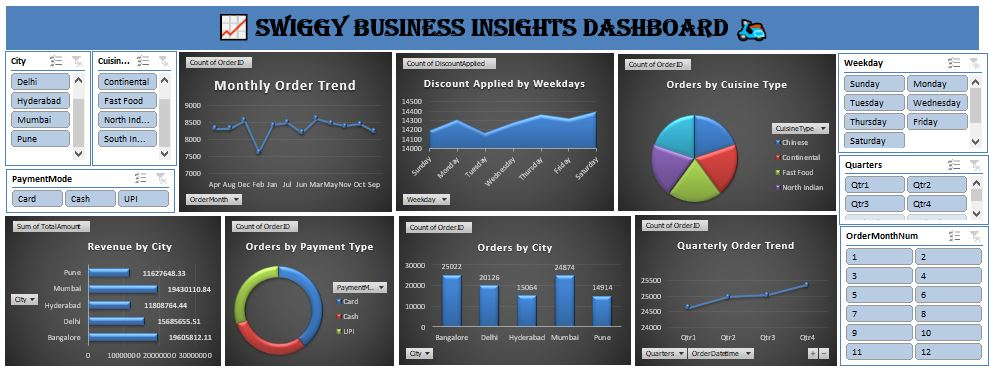
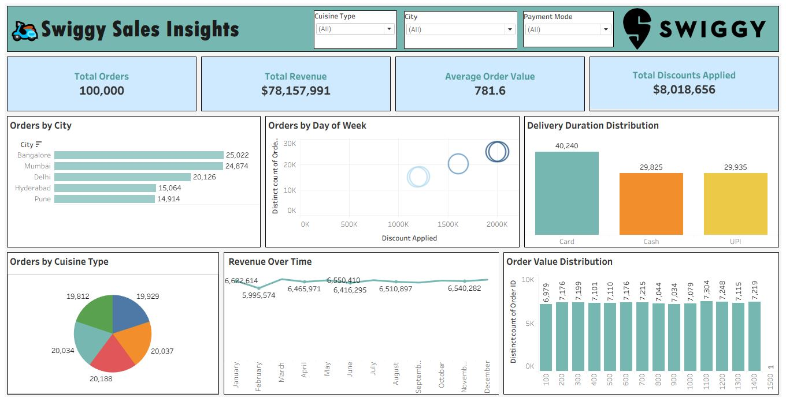

📊 Swiggy Sales Performance Dashboard (Excel)

An interactive **Excel** dashboard that analyzes Swiggy order trends, revenue generation, payment preferences, and cuisine patterns across cities and time periods. This dashboard offers key insights into total orders, revenue, and payment modes, helping stakeholders understand customer behavior and operational trends for Swiggy.

🛠️ Tools Used
**Excel:** Data cleaning, KPI calculations, pivot charts, and dashboard structuring.
**Power BI:** Advanced interactive dashboards, slicers, KPI cards, DAX measures, and drill-down analysis.
**Tableau:** Clean, story-driven dashboards with advanced visuals like donut charts, maps, and interactive filtering.

🔑 Key KPIs Tracked
- Total Orders
- Total Revenue
- Average Order Value
- Total Discounts Applied

🔑 Key Insights
- Identified peak ordering times and top-performing cuisines.
- Analyzed payment mode preferences among customers.
- Tracked KPIs like Total Orders, Total Revenue, and Average Order Value.
- Visualized city-wise and cuisine-wise order distributions.
- Filtered views using interactive slicers for city, payment mode, and cuisine type.

🚀 How to View the Dashboard
1. Download and open in respective tools.
2. Explore filters, slicers, and interactive visuals.
3. Review insights to understand Swiggy's operational trends.

🖼️ Dashboard Previews

📊 Excel Dashboard

📌 *Displays KPI cards, bar charts, trend analysis, and slicers for interactive filtering.*

📊 Power BI Dashboard

📌 *Includes interactive KPI cards, slicers, drill-down visuals for revenue, orders, and payment analysis.*

📊 Tableau Dashboard

📌 *Showcases donut charts, map-based analysis, order value distributions, and interactive storytelling.*

👩‍💻 Author
- **Name:** Pratiksha Mali  
- **LinkedIn:** [linkedin.com/in/pratiksha-mali-b42088221](https://www.linkedin.com/in/pratiksha-mali-b42088221)  
- **Email:** [pratiksha.mali2512@gmail.com](mailto:pratiksha.mali2512@gmail.com)
- **Portfolio:** [datascienceportfol.io/pratikshamali2512](https://www.datascienceportfol.io/pratikshamali2512)

## 📝 Description
This project was developed as part of my data analytics portfolio to demonstrate **Excel dashboarding proficiency in transforming raw order data into meaningful, decision-ready insights**. The dashboard replicates a real-world operational analysis scenario where business teams can track KPIs, drill into specific trends, and take data-driven actions to improve delivery and marketing strategies.
